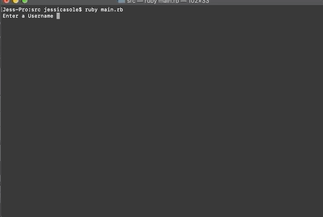
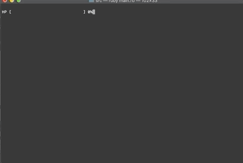
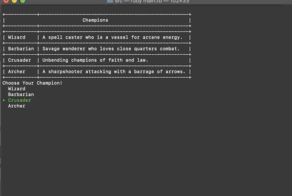
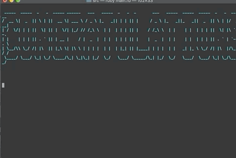
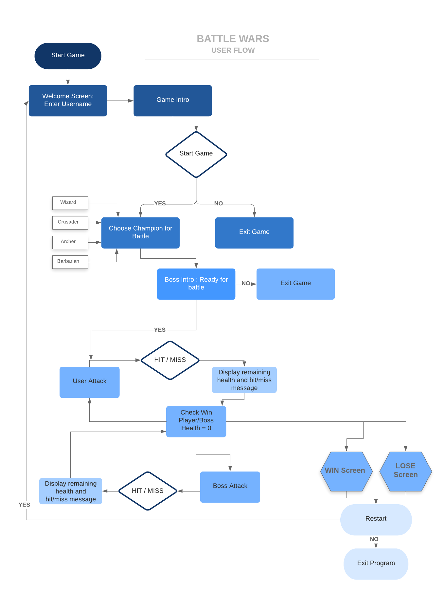
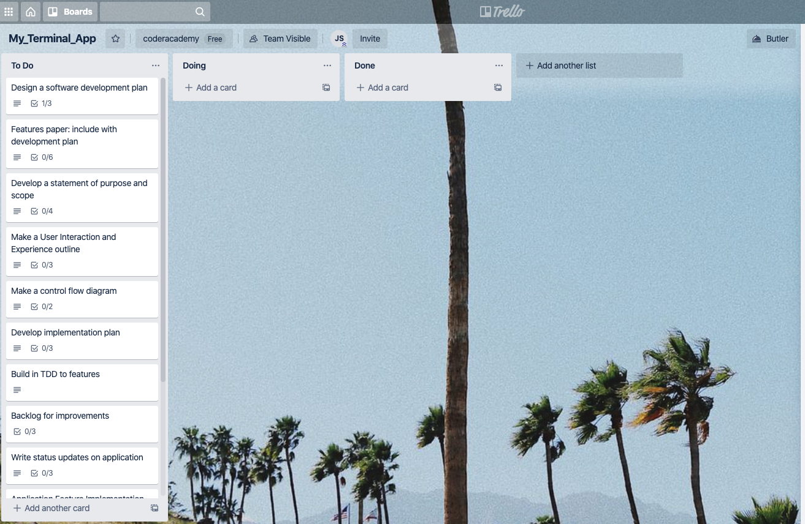
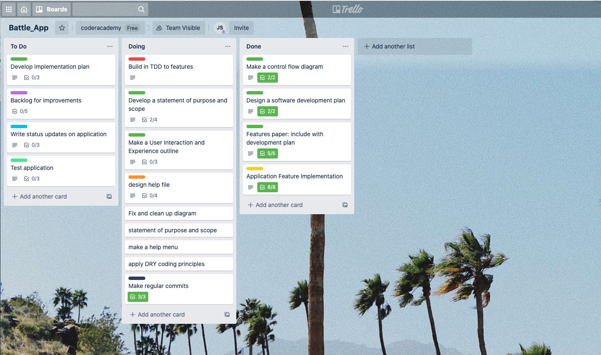
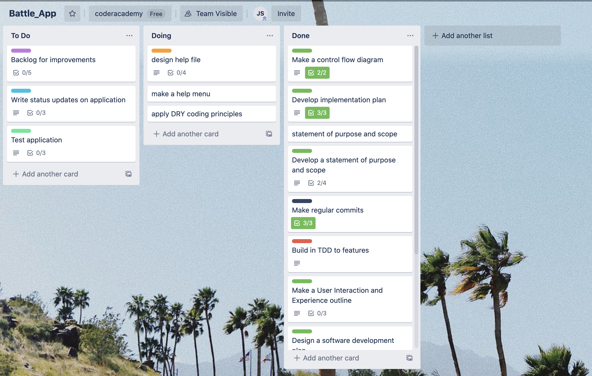

# Battle Wars

(https://github.com/Jese310S/battle_app)

# Software Development Plan

## Game Motivation and Description

This Terminal App was an assignment for Coder Academy.  For the assignment the first thing that came to mind was to build a game.  I knew I would enjoy creating the visual style of a terminal game, while utilising classes and other ruby development tools we learned.  I took inspiration from a couple of games, the first being Diablo and the second is Clash of Clans.  I liked the idea of a fighting game with a mid-evil theme.

Battle Wars is an RPG inspired turn based, attack style game.  After opening the terminal and starting the app the user will be asked to provide their username.  Once they are ready to play, the user will choose a champion for battle.  Next the user encounters the game boss.  Once ready the boss and user will take turns attacking. The winner is determined based on health points (HP). Whomever is left standing after their opponent has 0-HP wins the game.  

In the game the user is able to choose a champion, battle their enemy, Start New Game, or Exit

## Purpose and Scope

My target audience is anyone with access to a terminal.  The app is meant to bring some enjoyment to a busy working day.  I want the user to be able to stop what they are working on and take a mental break.  Many times all that is needed is a battle with a dragon to reenergise and finish a project.

An original idea for the game was to have the user choose a level they would like to play. This would increase the difficulty by changin the HP of the boss.  The user would then choose their army instead of a champion.  The choice of army would determine the users attack level.  I quickly realised that these features, although nice, were out of my scope for the moment.  If I spent too much time trying to implement these I would not have a quality outcome withing the week.  I then decided to change the user interactions without affecting the story. This allowed me to focus on producing a working app but still have the user interaction I wanted.  The out of scope features were added to my aspirational features list.

## Current Features

| Feature | Description | User Experience |
| ------ | ------ | ------- | 
| Username screen  | User will enter a chosen name to be used in the game | Prompt user for username
| Welcome Screen | Displays game logo and asks the user if they are ready to play | The title of the game in a stylised font prints to the screen with a description of the game. A yes/no prompt asks if they are ready to begin 
| Select Champion | User is given options and then chooses their champion | A table prints to screen with a description of the champions. User is then  prompted to select their champion from multiple choices with the arrow keys and spacebar.
| Attack Sequence | Player and boss take turns attacking each other | User is individually prompted to prepare for their attack and before the boss attacks. A message and progress bar appear after each.  The message describes the result of the attack and the progress bar shows the remaining HP percentage of the character attacked. 
| Win/Lose Screen | Display Win/Lose based on which character reaches zero health first | A Stylised Win or Lose screen prints to screen.
| Restart Game | At the end of the game, the user can restart or exit. | The user is prompted and asked if they would like to restart or exit.  If yes, the game is restarted and they enter a new username.

## Aspirational Features
| Feature | Description |
| ------ | ------ |
|Difficulty levels | The user will choose from multiple bosses which would change the difficulty( varying boss HP's)
|Army Choice | The user will choose multiple warriors to determine their attack strength. (ie. archer = 20 attack, wizard = 25 attack)

## Testing

I used the ruby gem RSPEC to write the apps tests. [RSPEC](https://rubygems.org/gems/rspec)

| Expected Action | Test | Actual Outcome |
| ------ | ------ | ------- |
| Welcome.new creates a new object  | should return true | As Expected
| Prompt username and store in player_name | should return "jess" if provided "jess" as username | As Expected
| Player.new creates a player object | should return true | As Expected
| Prompt to choose champion and store in champion variable | should return "Wizard" if Wizard is chosen| As Expected
| Damage is deducted from the players hp | should return the result of hp - the players damage stat| As Expected
| Return a float for the progress bar to run and display current health | should calculate the lost health and convert it to a float | As Expected
| Win screen is activated when the boss's health is zero | should return true if boss HP is = 0 | As Expected

## Game Screens

## User Flow

## Project Management
[App Trello Board](https://www.ruby-lang.org/en/)

I used Trello to organise and keep track of what I was working on. Trello helped me visualise what still needed to be completed by my set timeline.

## Getting Started

### Instructions for Installation and Use

1. You will need ruby installed on your computer. [Download Ruby Here](https://www.ruby-lang.org/en/).
2. You will also need the Bundler gem installed. It comes with the main ruby installation, but if you do not have it on your machine, you can install it with the following command:

`gem install bundler`

3. Fork or clone this repository down to your local computer [Clone App Here](https://github.com/Jese310S/battle_app.git).

4. Navigate into the repository.

`cd battle_app`

5. To finish install and start game and use the command:

`bash run.sh`

6. Enter your chosen username and enjoy the game.

## Running the Tests

From `/src` folder in repository on your computer, use the command:

`ruby tests.rb`

